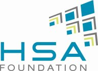
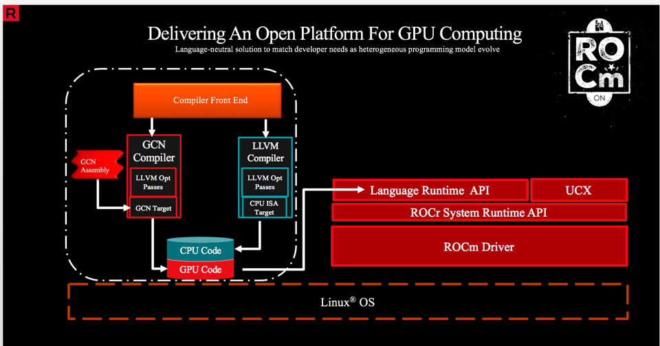

## Welcome to the ROCm Platform

We are excited to present ROCm, the first open-source
HPC/Hyperscale-class platform for GPU computing that’s also
programming-language independent. We are bringing the UNIX philosophy
of choice, minimalism and modular software development to GPU
computing. The new ROCm foundation lets you choose or even develop
tools and a language run time for your application.

**ROCm is built for scale**; it supports multi-GPU
computing in and out of server-node communication through RDMA. It
also simplifies the stack when the driver directly
incorporates RDMA peer-sync support.

**ROCm has a rich system run time** with the critical
features that large-scale application, compiler and language-run-time
development requires.

**HSA Compliant Runtime and Driver for AMD RADEON GPU's** 

### Going to 11: Amping Up the Programming-Language Run-Time Foundation

The ROCr System Runtime is language independent and makes
heavy use of the Heterogeneous System Architecture (HSA) Runtime API.
This approach provides a rich foundation to exectute programming languages such as HCC
C++ and HIP, the Khronos Group’s OpenCL, and Continum’s Anaconda Python.

Important features include the following:

 * Multi-GPU coarse-grain shared virtual memory
 * Process concurrency and preemption
 * Large memory allocations
 * HSA signals and atomics
 * User-mode queues and DMA
 * Standardized loader and code-object format
 * Dynamics and offline-compilation support
 * Peer-to-peer multi-GPU operation with RDMA support
 * Profiler trace and event-collection API
 * Systems-management API and tools

### Solid Compilation Foundation and Language Support

 *  LLVM compiler foundation
 *  HCC C++ and HIP for application portability
 *  GCN assembler and disassembler

The frontiers of what you can accomplish with ROCm are vast and
uncharted. We look forward to working with you to improve the platform
so you can use it more effectively in your own projects. Our efforts
have opened the door to unique heterogeneous-computing applications
that explore what this growing technology can do.
